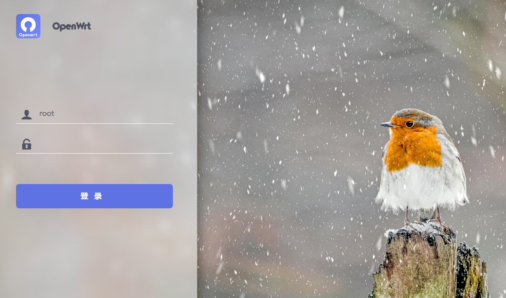
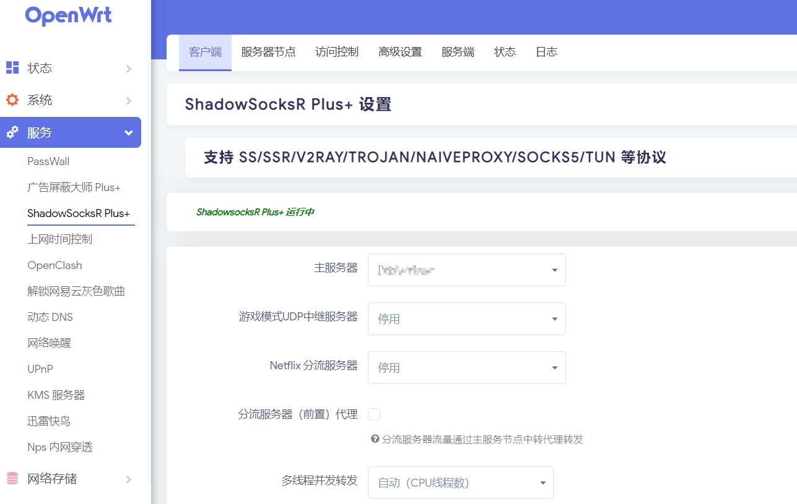

# Openwrt-Update-Script
Openwrt 固件一键检测更新/编译固件脚本！

【运行脚本请保证网络能科学】【固件默认x86-64架构·不要在root账户下运行】

【IP:192.168.1.2 USER:root PASSWD:password】

1.平台是基于win10 wsl2环境的linux 当然也可以运行到其他地方Linux上，推荐Ubuntu 18 LTS x64：
    
    a.脚本一键运行后有哪些插件？
    答：基本上就是群主自己定义的简单固件，大致包含常用插件该有的都有，但是绝不臃肿，可以看看下面部分固件截图；

    b.后期如何自定义自己插件？
    答：第一运行脚本会自动检测本地是否有源码，如果有，那么脚本的第一项“首次运行固件更新编译脚本”是不能用的；如果没有脚本会自动跑完获得和群主
    一样效果的固件；以后跑固件都是脚本的第二或者第三项目供大家选择，第一项主要是首次运行的初始化；至于自定义插件是在第一次编译成功后，以后
    在编译的时候，自己先进入源码目录make menucongfig下（ 如开发版：cd ~/lede && make menucongfig )即可自己选择好插件，然后运行脚本编译！
    注：自定义只需要修改一次！！只要不删除源码，自定义的不会被脚本覆盖。

    c.简单叙述下脚本特色？
    答：能在win10 wsl2环境的linux的Ubuntu 18 x64或者其他linux的Ubuntu 18 x64一键运行编译固件；
    本脚本不仅能自动检测lean大雕开发和稳定版源码分支有无更新，而且同步检测xray、openclash、passwall、helloword等组件有无更新，能在有更新的
    时编译固件；具体的百闻不如一试。

2.脚本升级为一键按傻瓜操作，无需自己配置，只需要准备好良好网络和一台充满能量的linux系统PC;

3.初次编译会花费很长时间，一般大约3-4小时，请耐心等待，不要惊慌失措，百无聊赖至于可以进群吹水打发时间；

4.一键脚本运行：

    cd && bash -c "$(wget -O- https://git.io/Jt8nn)"

5.若有问题讨论群：https://t.me/openwrt_lede_v2ray_plugin

6.附录部分脚本状态图片：

7.附录部分固件状态图片：

